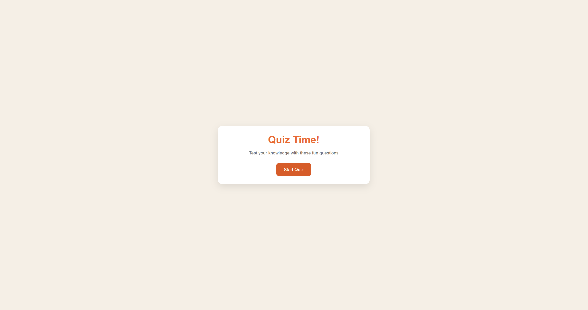
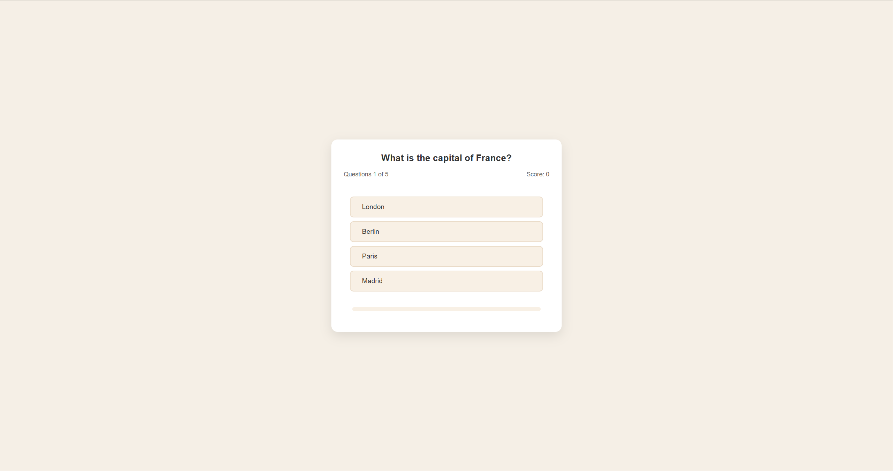
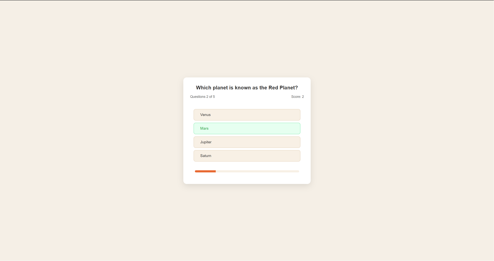
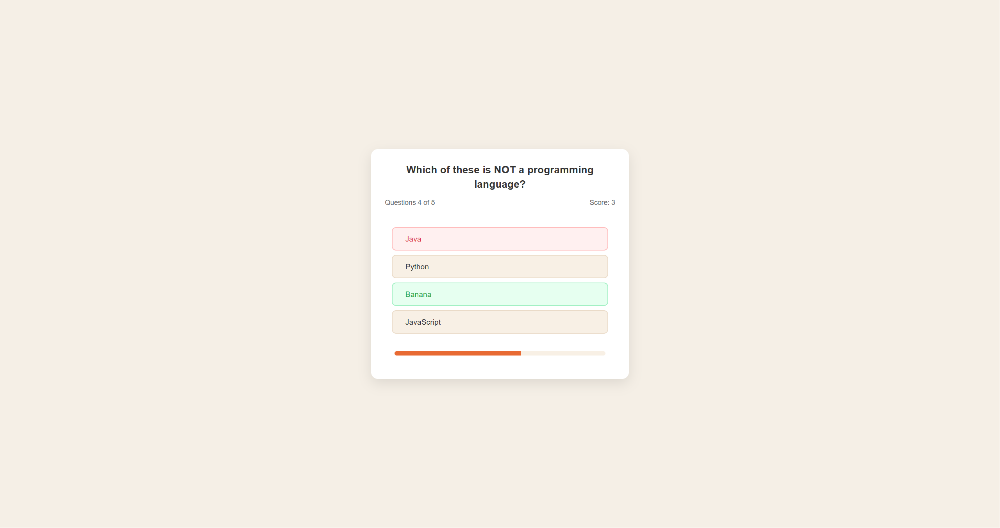
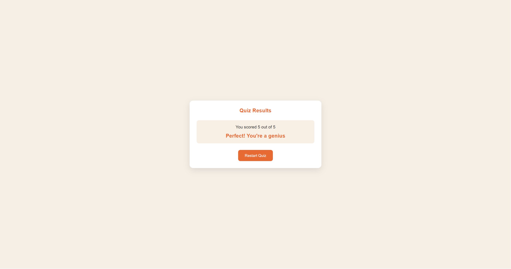

# 🧠 Quiz Game - Interactive Web App

> 🚀 **Live Demo:** [Click here to play the game](https://marwanalasmi.github.io/Quiz-Game/)

This project is a dynamic, interactive quiz game built as part of the 19 Web Dev Projects – HTML, CSS, JavaScript Tutorial by freeCodeCamp.org, created by Burak Orkmez.

## 📝 Project Overview

The Quiz Game is a client-side web application that tests general knowledge. It focuses on efficient DOM manipulation and state management using vanilla JavaScript to create a seamless user experience without page reloads.

## 🚀 Key Features

Dynamic Screen Switching: Uses CSS and JavaScript classes to toggle between start, quiz, and result screens.

Dynamic Question Generation: Answers are rendered programmatically from a data array, ensuring flexibility.

Real-time Feedback: Immediate visual cues (green for correct, red for incorrect) when an answer is selected.

Progress Tracking: A functional progress bar that updates as the user moves through the quiz.

Adaptive Scoring: A logic-based scoring system that provides personalized feedback based on the final percentage.

## 🛠️ Built With

HTML5: For the semantic structure of the application.

CSS3: For custom styling, layout, and responsive design elements.

JavaScript (ES6+): To handle the core game logic, event listeners, and UI updates.

## 📸 Screenshots

## 💡 Personal Improvements

_Under construction - I am currently working on custom features and refactoring the code._
